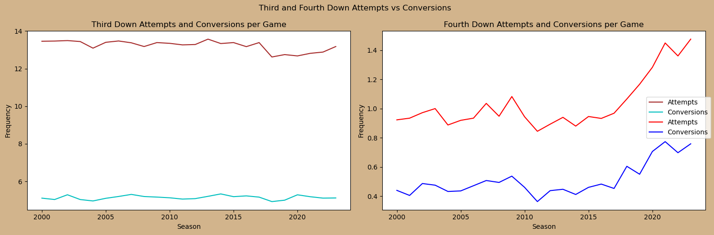

# Analysis of NFL Statistics-2000 to 2023
The NFL has undergone many structural changes this century. It has increased the number of teams with the addition of the Houston Texans in 2002, increased the number of games fom 16-17 in 2021, and has undergone rule change after rule change. Not only are teams constantly changing with player and coach turnover, the landscape of the NFL season is constantly evolving. This leads to the purpose of this project: to determine how the NFL has responded and if there are any general trends in response to the ever evolving game.

- Main Questions
    - How has the NFL changed over time?
    - Are there any interesting outlier seasons?

## Data Source:
- Data collected from each NFL game's boxscore data from ESPN
- Data is from the 2000 NFL season to the 2023 NFL season
    - Does not include preseason games
    - Includes postseason games
    - Some games happen the year after the season year, but are still considered to be in the earlier season.
        - Most of these games are postseason games

## Data cleaning:
- Removed ['nano', 'boxscore_stats_link', 'market', 'name'] columns from dataset
- Calculated pass_cmp_pct from pass_att/pass_cmp as data was missing from 2000 season
- Replaced 'LA' in alias with 'LAR' to help with data reading
- Changed event_date to dt value and added event_day column
- Calculated total touchdowns as total_tds column from pass_td + rush_td

## Column titles and Descriptions:

**`season`**

The Season's Year

**`name`**

nflSlowPy Name 

**`alias`**

nflSlowPy Alias

**`rush_att`**

Total Offensive Rushing Attempts

**`rush_yds`**

Total Offensive Rushing Yards

**`rush_tds`**

Total Offensive Rushing Touchdowns

**`pass_cmp`**

Total Offensive Passes Completed

**`pass_att`**

Total Offensive Passes Attempted

**`pass_cmp_pct`**

Ratio of Passes Completed to Attempts

**`pass_yds`**

Total Offensive Passing Yards

**`pass_tds`**

Total Offensive Passing Touchdowns

**`pass_int`**

Total Offensive Passing Interceptions

**`passer_rating`**

Team's Total Passer Rating

**`total_yds`**

Overall Offensive Yards

**`times_sacked`**

Total Times That a Quarterback(s) Was Sacked For

**`yds_sacked_for`**

Total Yards That a Quarterback(s) Was Sacked For

**`fumbles`**

Total Fumbles – Includes Those That Were Recovered and Lost

**`fumbles_lost`**

Fumbles Lost and Recovered by Opponent's Defense

**`turnovers`**

Total Turnovers, Including Fumbles Lost and Interceptions

**`penalties`**

Total Number of Offensive and Defensive Penalties

**`penalty_yds`**

Total Number of Offensive and Defensive Penalty Yards

**`first_downs`**

Total Offensive First Downs

**`third_down_conv`**

Offensive Third Down Conversions

**`third_down_att`**

Offensive Third Down Attempts

**`third_down_conv_pct`**

Ratio of Third Down Conversions to Attempts

**`fourth_down_conv`**

Offensive Fourth Down Conversions

**`fourth_down_att`**

Offensive Fourth Down Attempts

**`fourth_down_conv_pct`**

Ratio of Fourth Down Conversions to Attempts

**`time_of_possession`**

Total Offensive Possession Time in Seconds

## Correlations:

- Most of the observed correlations make sense in the context of the game
    - More rush attempts, more first downs, more third downs = longer time of possession
    - More turnovers = lower passer rating
    - More sacks/sack yards lost = less TDs
    - More rush attempts = less pass attempts and vice versa
    - Passer rating most possitively impacted by pass completions and TDs, less so yardage

## Initial Insights:

- General upward trend in offensive production over time
    - Mostly through the air, pass yards increased overall from ~220/game to a peak around ~260/game
    - Rushing has been more turbulent, yet less of a change overall from ~112/game to a peak around ~120/game
- Decline in total yardage after both expansions of the NFL season
    - 32nd team added in 2002, the Houston Texans
    - Increased season length from 16 to 17 games in 2021
- Dip in rushing production from 2013-2017
- Large drop in overall production in 2017
    - Drop of nearly 20 pass yards/game
    - Rush yards had an increase, however it was less than one yard/game
- 2020 overall highest average and total yardage gained
    - Covid year, no crowds to create confusion through noise

- Touchdowns have generally increased over the 23 seasons
    - Both rushing and passing have increased slightly
    - Only an average of ~.25 more in total a game
    - Not as dramatic an increase as passing yardage

## New Questions
- Why was there a drop after both expansions?
    - Potential answers:
        - Better defensive production
        - Increased length of season leading to a more tired team overall
        - Greater injury risk
- What caused the dip in 2017?
    - Fluke or was the NFL's average defense especially dominant that year?

## Sack Stats:

2017 Season decrease in overall yardage does not appear to be affected by sacks.
- While sack yards lost has generally increased over time, actual sack numbers tend to fluctuate between 2-2.5 sacks a game
- What about third/fourth down efficiency?

## Down Stats:

Third down has remained relatively unchanged. Fourth down attempts and success has steadily increased
- Does not appear to have any significant impact in 2017 however

## Quarterback Efficiency:

Overall quarterback efficiency has steadily increased over time
- Generally, QB efficiency has steadily increased, up to a peak in 2020
    - 2020 peak most likely due to less outside factors due to COVID
        - No live crowds
        - Less congested travel
    - What happened in 2017?
        - A significant drop in passer rating and completions
        - A slight rise in interceptions a game

## Bonus Chart:

This chart is from a separate dataset, but highlights the fluke of the 2017 season.

## Conclusions:
- 2017 season was an outlier, mostly due to poor Quarterback play
- The NFL has generally gotten better over time offensively, with less mistakes and more average yards a game
- Passing has had a higher impact than rushing this century
    - While passing yards have generally increased every season, rushing yards have been decreasing until recently
- Quarterback play is crucial to offensive success

## Further Areas to Explore:
- How kicking/punting stats have changed overtime
- More defensive stats analysis
- What caused the drop in efficiency after moving to a 17 game season
    - Higher risk of injury?
    - More fatigue?
    - More tape every year for defenses to analyze?
- Were the "Dynasty" teams of the Patriots and Chiefs significantly more successful overall or is it mostly just postseason success?